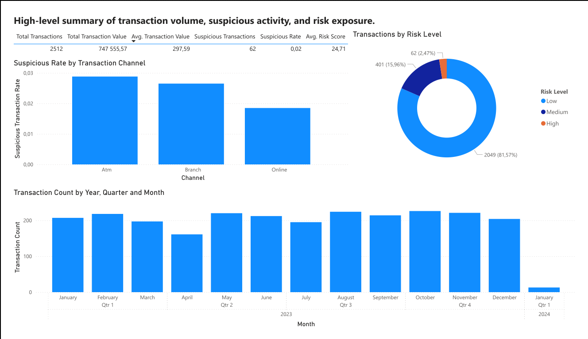
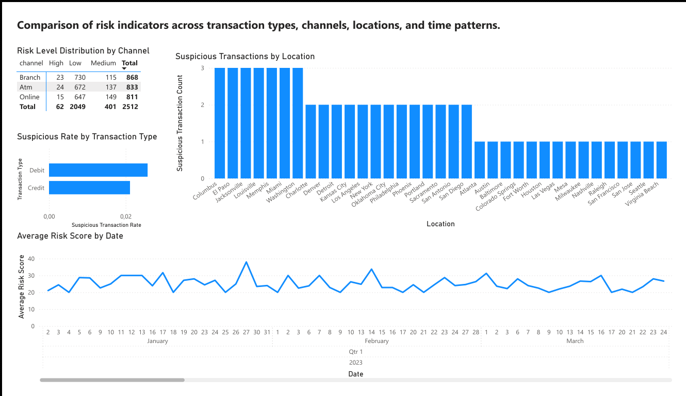
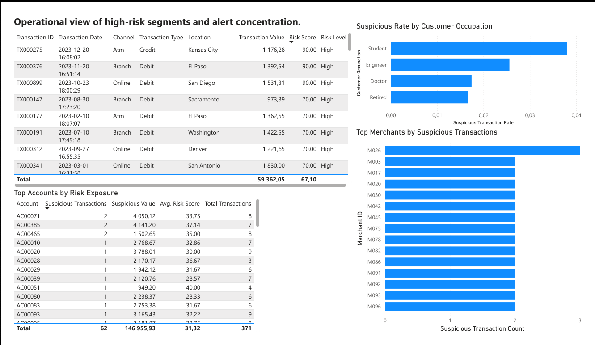
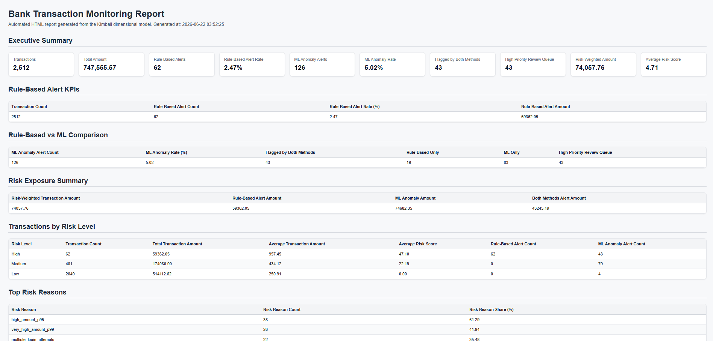
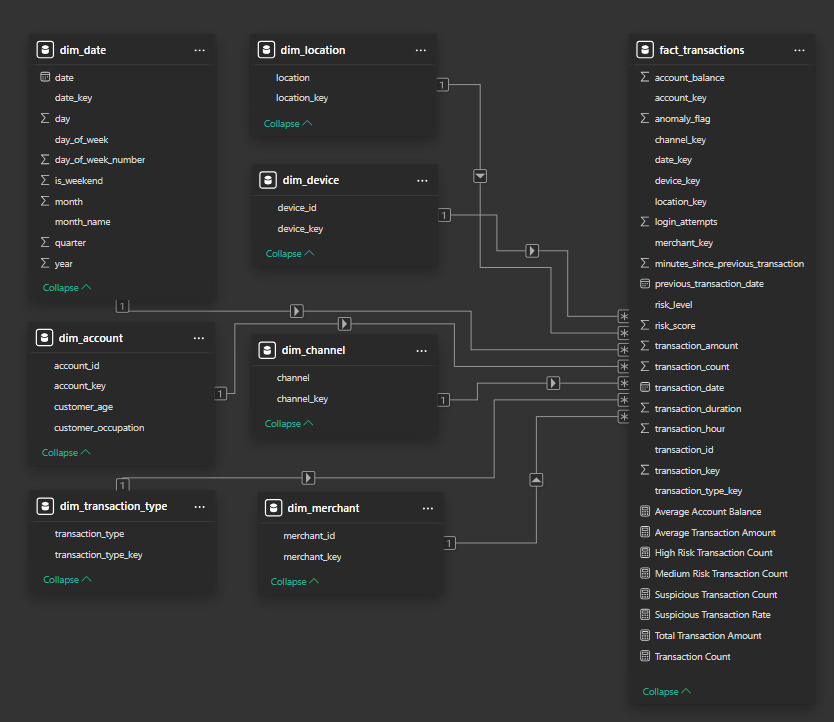
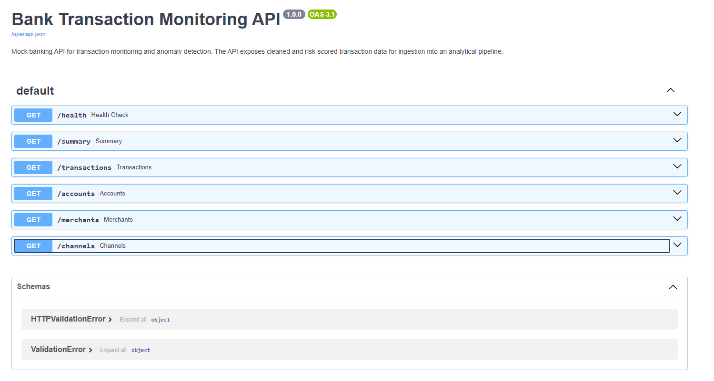

# Bank Transaction Monitoring and Rule-Based Risk Scoring Pipeline

## Project summary

This project demonstrates an end-to-end analytics and reporting pipeline for bank transaction monitoring. It simulates a small analytical system that helps identify potentially suspicious transactions, prioritize cases for further review, and monitor transaction risk KPIs.

The project includes programmatic data ingestion, data cleaning, feature engineering, rule-based risk scoring, a Kimball dimensional model, SQL KPI queries, an automated HTML report, a FastAPI mock banking API, and a Power BI dashboard.

> Current version uses transparent rule-based risk scoring. The dataset does not contain confirmed fraud labels, so the project does not implement supervised fraud classification. Unsupervised anomaly detection, such as Isolation Forest, is planned as a future extension.

## Business problem

Financial institutions need to monitor transaction activity and identify transactions that may require further review. In many real-world scenarios, confirmed fraud labels are unavailable, delayed, or incomplete. Therefore, analysts often need transparent monitoring logic that helps prioritize potentially suspicious transactions before final confirmation.

This project addresses that scenario by building a reproducible pipeline that assigns a risk score to each transaction and produces analytical outputs for monitoring, reporting, and operational review.

## Business value

The pipeline supports:

* monitoring transaction volume and risk exposure,
* identifying potentially suspicious transactions,
* prioritizing high-risk cases for review,
* analyzing risk patterns by channel, transaction type, location, and hour,
* generating repeatable KPI reports,
* preparing structured data for Power BI dashboarding.

## Key results

The project generates:

* cleaned transaction data,
* risk-scored transaction data,
* `risk_score`, `suspicious_flag`, `risk_level`, and `risk_reasons`,
* configurable risk scoring rules stored in `config/risk_rules.yaml`,
* SQLite analytical warehouse,
* Kimball dimensional model,
* SQL KPI outputs,
* responsive HTML report,
* Power BI dashboard,
* FastAPI mock banking API.

## Screenshots

### Power BI — Executive Risk Overview



### Power BI — Risk Drivers



### Power BI — Operational Monitoring



### Automated HTML report



### Kimball dimensional model



### FastAPI mock banking API



## Key features

* Programmatic data ingestion from KaggleHub.
* Data cleaning and feature engineering pipeline in Python.
* Transparent rule-based transaction risk scoring.
* Kimball dimensional model with fact and dimension tables.
* SQLite analytical warehouse.
* SQL KPI queries for transaction monitoring.
* Automated responsive HTML report.
* Power BI dashboard with three analytical pages.
* FastAPI mock banking API.
* One-command pipeline orchestration.

## Tech stack

* Python
* pandas
* KaggleHub
* SQLite
* SQL
* FastAPI
* Uvicorn
* Power BI
* Git/GitHub

## Data source

The project uses the **Bank Transaction Dataset for Fraud Detection** from Kaggle:

```text
valakhorasani/bank-transaction-dataset-for-fraud-detection
```

The data is downloaded programmatically using KaggleHub. Raw data files are excluded from version control.

## Modeling approach

The dataset does not contain a confirmed fraud label. Therefore, the project does not classify transactions as confirmed fraud or non-fraud.

Instead, the project focuses on transaction monitoring and rule-based anomaly detection. The generated `suspicious_flag` should be interpreted as a signal for potentially suspicious transactions, not as a confirmed fraud label.

The risk scoring logic is intentionally separated from the data cleaning pipeline to make future development easier.

## Pipeline

```text
KaggleHub
    ↓
Raw data
    ↓
Data cleaning and feature engineering
    ↓
Rule-based risk scoring
    ↓
Kimball dimensional model
    ↓
SQLite analytical warehouse
    ↓
SQL KPI queries
    ↓
Automated HTML report
    ↓
CSV export for Power BI
    ↓
Power BI dashboard
```

The FastAPI mock API is implemented as a separate module and can be used to simulate ingestion from a banking source system.

## Repository structure

```text
financial-fraud-analytics-pipeline/
├── app/
│   ├── main.py
│   └── services/
│       ├── __init__.py
│       └── data_service.py
├── data/
│   ├── api/
│   ├── model/
│   ├── processed/
│   └── raw/
├── docs/
│   ├── dashboard_screenshots/
│   ├── kimball_dimensional_model.md
│   └── risk_scoring_method.md
├── powerbi/
│   └── transaction_monitoring_dashboard.pbix
├── reports/
├── scripts/
│   ├── 00_download_data.py
│   ├── 01_inspect_data.py
│   ├── 02_profile_data.py
│   ├── 03_clean_transactions.py
│   ├── 04_score_transactions.py
│   ├── 05_build_dimensional_model.py
│   ├── 06_test_kpi_queries.py
│   ├── 07_generate_html_report.py
│   ├── 08_export_model_tables.py
│   ├── 09_fetch_from_api.py
│   └── 10_run_pipeline.py
├── sql/
│   └── 01_kpi_queries.sql
├── warehouse/
├── .gitignore
├── README.md
└── requirements.txt
```

## How to run

### 1. Clone the repository

```bash
git clone <repository-url>
cd financial-fraud-analytics-pipeline
```

### 2. Create and activate a virtual environment

Windows:

```bash
python -m venv .venv
.venv\Scripts\activate
```

macOS/Linux:

```bash
python -m venv .venv
source .venv/bin/activate
```

### 3. Install dependencies

```bash
pip install -r requirements.txt
```

### 4. Run the full analytical pipeline

```bash
python scripts/10_run_pipeline.py
```

This command executes the main analytical workflow:

1. downloads raw data from KaggleHub,
2. inspects and profiles raw data,
3. cleans transaction data,
4. applies rule-based risk scoring,
5. builds the Kimball dimensional model,
6. tests SQL KPI queries,
7. generates the automated HTML report,
8. exports model tables for Power BI.

### 5. Open generated outputs

After the pipeline completes, the main generated files are:

```text
data/processed/transactions_clean.csv
data/processed/transactions_scored.csv
warehouse/transaction_monitoring.db
reports/transaction_monitoring_report.html
data/model/*.csv
```

Generated data files, warehouse files, and HTML reports are excluded from version control.

## Mock banking API

The project includes a FastAPI-based mock banking API that exposes cleaned and risk-scored transaction data. The API simulates a banking source system used by the analytical pipeline.

### Available endpoints

* `GET /health`
* `GET /summary`
* `GET /transactions`
* `GET /accounts`
* `GET /merchants`
* `GET /channels`

### Run the API locally

The API is run separately because it is a long-running local service.

```bash
uvicorn app.main:app --reload
```

After starting the API, the interactive API documentation is available at:

```text
http://127.0.0.1:8000/docs
```

### Test the API

To check whether the API is running correctly, open:

```text
http://127.0.0.1:8000/health
```

Expected response:

```json
{"status":"ok"}
```

You can also open the summary endpoint:

```text
http://127.0.0.1:8000/summary
```

The root URL may return `404 Not Found` if no `/` endpoint is defined. Use `/docs`, `/health`, or the listed endpoints to test the API.

### Fetch data from the API

With the API running, execute the following command in a second terminal:

```bash
python scripts/09_fetch_from_api.py
```

The API response will be saved locally to:

```text
data/api/transactions_from_api.csv
```

Raw API output files are excluded from version control.

## Kimball dimensional model

The analytical layer follows the Kimball dimensional modeling approach. Transaction-level events are stored in the central fact table, while descriptive business context is separated into dimension tables.

### Fact table

```text
fact_transactions
```

The grain of the fact table is one row per bank transaction.

Main measures and indicators:

* `transaction_amount`
* `transaction_duration`
* `login_attempts`
* `account_balance`
* `minutes_since_previous_transaction`
* `transaction_count`
* `risk_score`
* `suspicious_flag`
* `risk_level`
* `risk_reasons`

### Dimension tables

```text
dim_account
dim_date
dim_merchant
dim_channel
dim_location
dim_device
dim_transaction_type
```

All relationships follow a one-to-many structure from dimension tables to the fact table.

Detailed documentation is available in:

```text
docs/kimball_dimensional_model.md
```

## Risk scoring method

The project uses transparent rule-based risk scoring to identify transactions that may require further review. Since the dataset does not contain confirmed fraud labels, the generated indicators should not be interpreted as confirmed fraud predictions.

Each transaction receives four main risk-related variables:

| Variable          | Description                                                                          |
| ----------------- | ------------------------------------------------------------------------------------ |
| `risk_score`      | Numerical risk score from 0 to 100 calculated from rule-based indicators.            |
| `suspicious_flag` | Binary flag indicating whether the transaction exceeds the suspiciousness threshold. |
| `risk_level`      | Categorical risk level: `Low`, `Medium`, or `High`.                                  |
| `risk_reasons`    | Interpretable reason codes explaining why the transaction received risk points.      |

Example risk reason codes include:

| Reason code                                 | Interpretation                                                  |
| ------------------------------------------- | --------------------------------------------------------------- |
| `high_amount_p95`                           | Transaction amount is at or above the 95th percentile.          |
| `very_high_amount_p99`                      | Transaction amount is at or above the 99th percentile.          |
| `multiple_login_attempts`                   | The transaction is associated with more than one login attempt. |
| `long_transaction_duration`                 | Transaction duration is unusually long.                         |
| `low_account_balance`                       | Account balance is at or below the 5th percentile.              |
| `night_transaction`                         | Transaction occurred during night hours.                        |
| `short_interval_since_previous_transaction` | Transaction occurred shortly after the previous transaction.    |

Risk scoring rules are stored in:

```text
config/risk_rules.yaml
```

This makes the scoring logic transparent and easy to adjust without modifying the Python source code.

Example configuration fragment:

```yaml
amount:
  high_amount_quantile: 0.95
  high_amount_points: 30
  very_high_amount_quantile: 0.99
  very_high_amount_points: 20

classification:
  suspicious_threshold: 60
  max_risk_score: 100
  low_risk_max: 29
  medium_risk_max: 59
```

The scoring logic is intentionally separated from the data cleaning stage. This makes the pipeline easier to maintain and allows future extensions, such as unsupervised anomaly detection models.

Detailed documentation is available in:

```text
docs/risk_scoring_method.md
```

## SQL KPI queries

SQL queries are stored in:

```text
sql/01_kpi_queries.sql
```

The queries cover:

* transaction volume,
* transaction value,
* suspicious transaction count,
* suspicious transaction rate,
* risk by channel,
* risk by transaction type,
* risk by location,
* risk by hour,
* top high-risk transactions.

## Automated HTML report

The automated report is generated by:

```bash
python scripts/07_generate_html_report.py
```

The generated report is saved to:

```text
reports/transaction_monitoring_report.html
```

The report includes:

* executive KPI summary,
* risk level distribution,
* risk by channel,
* risk by transaction type,
* risk by location,
* high-risk transaction review table,
* risk by hour of day.

## Power BI dashboard

The Power BI dashboard contains three analytical pages:

1. **Executive Risk Overview**
   High-level summary of transaction volume, suspicious activity, and risk exposure.

2. **Risk Drivers**
   Analysis of risk indicators across channels, transaction types, locations, and time patterns.

3. **Operational Monitoring**
   Operational view of high-risk segments and transactions requiring further review.

The Power BI file is stored in:

```text
powerbi/transaction_monitoring_dashboard.pbix
```

Dashboard screenshots can be stored in:

```text
docs/dashboard_screenshots/
```

## Project outputs

The project generates the following local artifacts:

| Output                   | Path                                            | Description                                                                                                       |
| ------------------------ | ----------------------------------------------- | ----------------------------------------------------------------------------------------------------------------- |
| Clean dataset            | `data/processed/transactions_clean.csv`         | Cleaned transaction data after standardization, date parsing, validation, deduplication, and feature engineering. |
| Scored dataset           | `data/processed/transactions_scored.csv`        | Transactions enriched with `risk_score`, `suspicious_flag`, `risk_level`, and `risk_reasons`.                     |
| Risk rules configuration | `config/risk_rules.yaml`                        | YAML configuration file containing scoring thresholds, quantiles, points, and classification thresholds.          |
| SQLite warehouse         | `warehouse/transaction_monitoring.db`           | Local analytical warehouse with fact and dimension tables.                                                        |
| HTML report              | `reports/transaction_monitoring_report.html`    | Automated KPI report generated from the SQLite warehouse.                                                         |
| Power BI exports         | `data/model/*.csv`                              | Model tables exported for Power BI.                                                                               |
| API output               | `data/api/transactions_from_api.csv`            | Data fetched from the local FastAPI mock banking API.                                                             |
| Power BI dashboard       | `powerbi/transaction_monitoring_dashboard.pbix` | Interactive Power BI dashboard with executive, risk driver, and operational monitoring pages.                     |


## Version control notes

The repository excludes generated and local files such as:

* raw data files,
* processed data files,
* exported model CSV files,
* SQLite warehouse files,
* generated HTML reports,
* API output files,
* virtual environments,
* local IDE settings.

This keeps the repository lightweight and reproducible.

## Limitations

The dataset does not include confirmed fraud labels. Therefore, the project does not implement supervised fraud classification.

The generated `suspicious_flag` is a transaction monitoring signal and should not be interpreted as confirmed fraud. The current `risk_score` is based on a heuristic rule-based approach and is intended for analytical and portfolio purposes.

## Future improvements

Potential extensions include:

* configurable risk scoring rules,
* moving scoring thresholds to a YAML or JSON configuration file,
* adding risk reason codes,
* comparing rule-based scoring with unsupervised anomaly detection,
* adding an Isolation Forest model,
* adding Docker support,
* adding automated tests,
* adding a Streamlit dashboard,
* publishing the API or report through a lightweight cloud deployment.

## Portfolio summary

This project demonstrates the ability to design and implement an end-to-end analytics workflow, including data ingestion, data preparation, dimensional modeling, SQL analytics, report automation, API development, and Power BI dashboarding.
