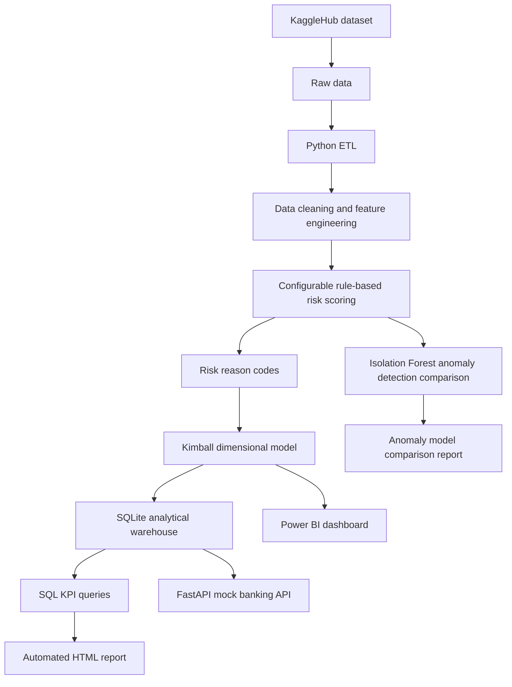
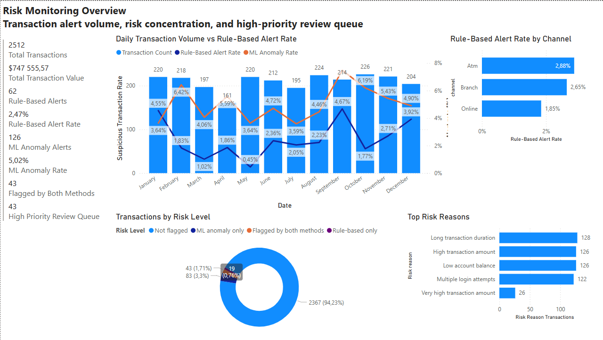
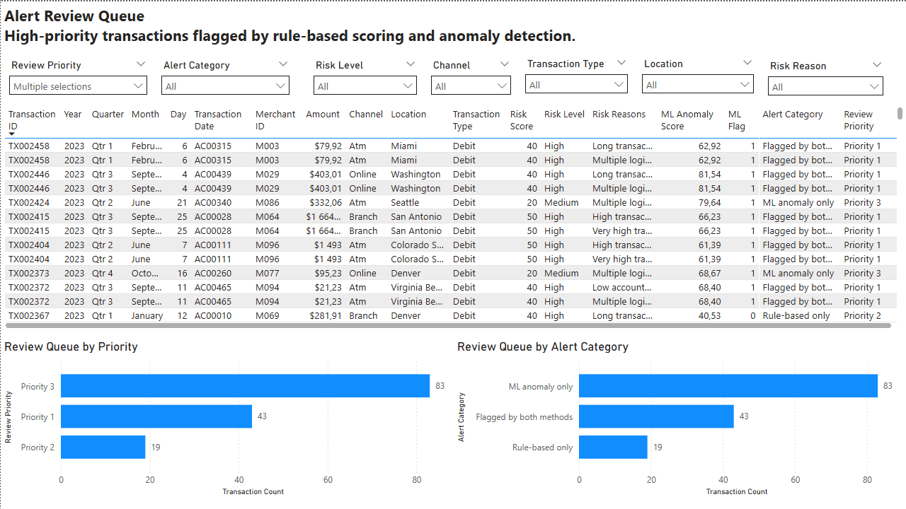
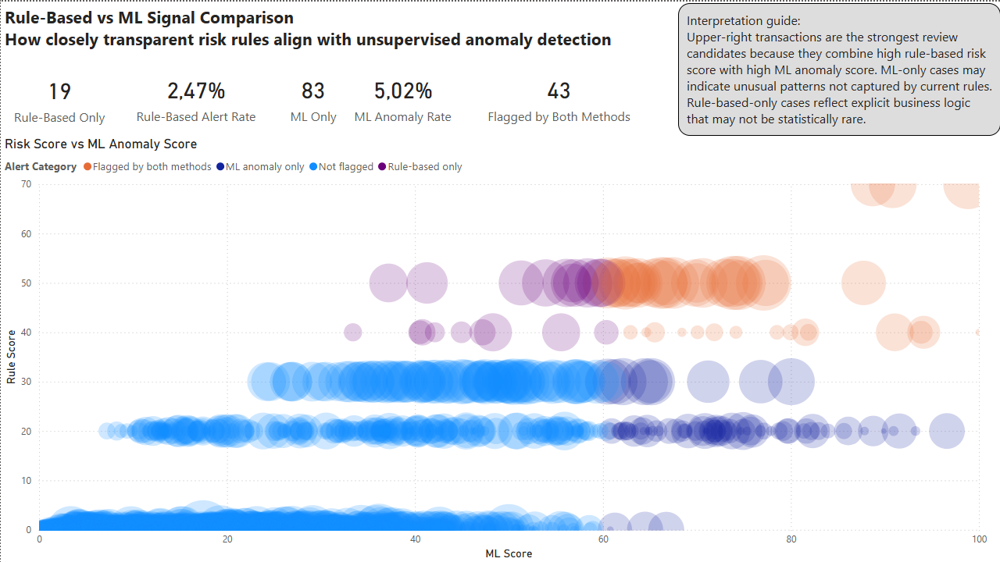
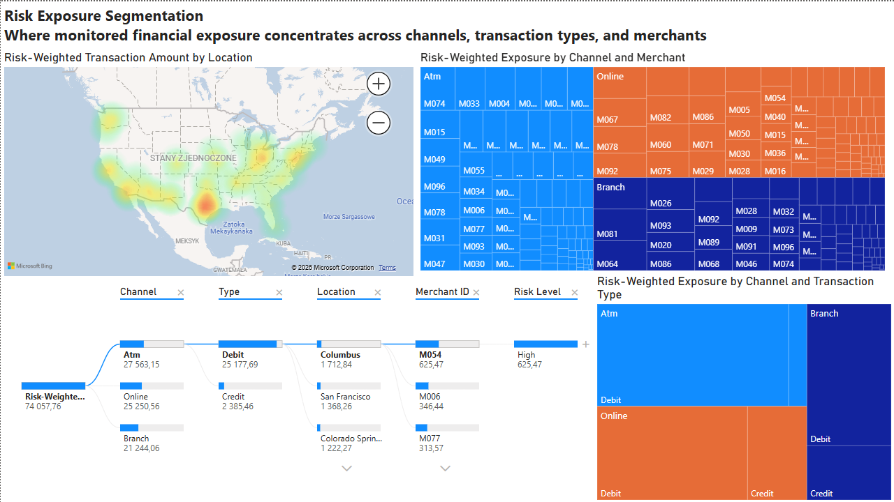

# Bank Transaction Monitoring and Rule-Based Risk Scoring Pipeline


## Project summary

This project demonstrates an end-to-end analytics and reporting pipeline for bank transaction monitoring. It simulates a small analytical system that helps identify potentially suspicious transactions, prioritize cases for further review, and monitor transaction risk KPIs.

The project includes programmatic data ingestion, data cleaning, feature engineering, configurable rule-based risk scoring, interpretable risk reason codes, an Isolation Forest anomaly detection comparison, a Kimball dimensional model, SQL KPI queries, an automated HTML report, a FastAPI mock banking API, Docker support, automated tests, GitHub Actions, and a Power BI dashboard.

> The dataset does not contain confirmed fraud labels. Therefore, the project does not implement supervised fraud classification. The generated risk indicators should be interpreted as transaction monitoring signals, not confirmed fraud predictions.

## Business problem

Financial institutions need to monitor transaction activity and identify transactions that may require further review. In many real-world scenarios, confirmed fraud labels are unavailable, delayed, or incomplete. Therefore, analysts often need transparent monitoring logic that helps prioritize potentially suspicious transactions before final confirmation.

This project addresses that scenario by building a reproducible pipeline that assigns a risk score to each transaction and produces analytical outputs for monitoring, reporting, and operational review.

## Business value

The pipeline supports:

* monitoring transaction volume and risk exposure,
* identifying potentially suspicious transactions,
* prioritizing high-risk cases for review,
* explaining risk scores with interpretable reason codes,
* analyzing risk patterns by channel, transaction type, location, and hour,
* comparing transparent business rules with unsupervised anomaly detection,
* generating repeatable KPI reports,
* preparing structured data for Power BI dashboarding.
* segmenting risk-weighted financial exposure across merchants, channels, transaction types, and locations.

## Key results

The project generates:

* cleaned transaction data,
* risk-scored transaction data,
* `risk_score`, `suspicious_flag`, `risk_level`, and `risk_reasons`,
* configurable risk scoring rules stored in `config/risk_rules.yaml`,
* Isolation Forest anomaly detection outputs,
* comparison between rule-based scoring and ML-based anomaly detection,
* SQLite analytical warehouse,
* Kimball dimensional model,
* SQL KPI outputs,
* responsive HTML report,
* Power BI dashboard,
* FastAPI mock banking API,
* Docker-based execution,
* automated pytest checks,
* GitHub Actions workflow for continuous testing.

## Architecture



## Screenshots

### Power BI — Risk Monitoring Overview



### Power BI — Alert Review Queue



### Power BI — Rule-Based vs ML Signal Comparison



### Power BI — Risk Exposure Segmentation



### Automated HTML report


### Kimball dimensional model


### FastAPI mock banking API


## Key features

* Programmatic data ingestion from KaggleHub.
* Data cleaning and feature engineering pipeline in Python.
* Transparent rule-based transaction risk scoring.
* Interpretable risk reason codes.
* YAML-based scoring configuration.
* Isolation Forest anomaly detection comparison.
* Kimball dimensional model with fact and dimension tables.
* SQLite analytical warehouse.
* SQL KPI queries for transaction monitoring.
* Automated responsive HTML report.
* Power BI dashboard with four decision-oriented analytical pages.
* FastAPI mock banking API.
* Docker support for the pipeline and API.
* Automated pytest checks.
* GitHub Actions workflow for continuous testing.
* One-command pipeline orchestration.

## Tech stack

* Python
* pandas
* scikit-learn
* PyYAML
* KaggleHub
* SQLite
* SQL
* FastAPI
* Uvicorn
* pytest
* Docker
* GitHub Actions
* Power BI
* Git/GitHub

## Data source

The project uses the **Bank Transaction Dataset for Fraud Detection** from Kaggle:

```text
valakhorasani/bank-transaction-dataset-for-fraud-detection
```

The data is downloaded programmatically using KaggleHub. Raw data files are excluded from version control.

## Modeling approach

The dataset does not contain a confirmed fraud label. Therefore, the project does not classify transactions as confirmed fraud or non-fraud.

Instead, the project focuses on transaction monitoring and risk prioritization. It uses two complementary approaches:

1. **Rule-based risk scoring** — transparent business logic that assigns risk points and reason codes.
2. **Unsupervised anomaly detection** — Isolation Forest model used as a comparison layer for identifying statistically unusual transactions.

The generated `suspicious_flag` and `ml_anomaly_flag` should be interpreted as monitoring signals, not confirmed fraud labels.

## Pipeline

```text
KaggleHub
↓
Raw data
↓
Data inspection and profiling
↓
Data cleaning and feature engineering
↓
Configurable rule-based risk scoring
↓
Risk reason codes
↓
Isolation Forest anomaly detection comparison
↓
Kimball dimensional model
↓
SQLite analytical warehouse
↓
SQL KPI queries
↓
Automated HTML report
↓
CSV export for Power BI
↓
Power BI dashboard
```

The FastAPI mock API is implemented as a separate module and can be used to simulate access to a banking source system.

## Repository structure

```text
Bank-Transaction-Monitoring-and-Risk-Scoring-Pipeline/
├── .github/
│   └── workflows/
│       └── tests.yml
├── app/
│   ├── main.py
│   └── services/
│       ├── __init__.py
│       └── data_service.py
├── config/
│   ├── anomaly_model.yaml
│   └── risk_rules.yaml
├── data/
│   ├── api/
│   ├── model/
│   ├── processed/
│   └── raw/
├── docs/
│   ├── screenshots/
│   ├── kimball_dimensional_model.md
│   └── risk_scoring_method.md
├── powerbi/
│   └── transaction_monitoring_dashboard.pbix
├── reports/
├── scripts/
│   ├── 00_download_data.py
│   ├── 01_inspect_data.py
│   ├── 02_profile_data.py
│   ├── 03_clean_transactions.py
│   ├── 04_score_transactions.py
│   ├── 05_build_dimensional_model.py
│   ├── 06_test_kpi_queries.py
│   ├── 07_generate_html_report.py
│   ├── 08_export_model_tables.py
│   ├── 09_fetch_from_api.py
│   ├── 10_run_pipeline.py
│   └── 11_train_anomaly_model.py
├── sql/
│   └── 01_kpi_queries.sql
├── tests/
│   ├── conftest.py
│   ├── test_api.py
│   └── test_pipeline_outputs.py
├── warehouse/
├── .dockerignore
├── .gitignore
├── Dockerfile
├── README.md
├── docker-compose.yml
└── requirements.txt
```

## How to run locally

### 1. Clone the repository

```bash
git clone https://github.com/adrian-kabat/Bank-Transaction-Monitoring-and-Risk-Scoring-Pipeline.git
cd Bank-Transaction-Monitoring-and-Risk-Scoring-Pipeline
```

### 2. Create and activate a virtual environment

Windows:

```bash
python -m venv .venv
.venv\Scripts\activate
```

macOS/Linux:

```bash
python -m venv .venv
source .venv/bin/activate
```

### 3. Install dependencies

```bash
pip install -r requirements.txt
```

### 4. Run the full analytical pipeline

```bash
python scripts/10_run_pipeline.py
```

This command executes the main analytical workflow:

1. downloads raw data from KaggleHub,
2. inspects and profiles raw data,
3. cleans and validates transaction data,
4. applies configurable rule-based risk scoring,
5. adds interpretable risk reason codes,
6. runs the Isolation Forest anomaly detection comparison,
7. builds the Kimball dimensional model,
8. creates the SQLite analytical warehouse,
9. tests SQL KPI queries,
10. generates the automated HTML report,
11. exports model tables for Power BI.

### 5. Open generated outputs

After the pipeline completes, the main generated files are:

```text
data/processed/transactions_clean.csv
data/processed/transactions_scored.csv
data/processed/transactions_with_anomaly_model.csv
warehouse/transaction_monitoring.db
reports/transaction_monitoring_report.html
reports/anomaly_model_comparison.csv
data/model/*.csv
```

Generated data files, warehouse files, and HTML reports are excluded from version control.

## How to run with Docker

The project can also be executed with Docker. This provides a reproducible way to run the analytical pipeline and the FastAPI mock banking API without manually configuring the local Python environment.

### Build Docker images

```bash
docker compose build
```

### Run the full analytical pipeline

```bash
docker compose run --rm pipeline
```

### Run the FastAPI mock banking API

```bash
docker compose up api
```

After starting the API, open the interactive API documentation:

```text
http://127.0.0.1:8000/docs
```

To stop the API, press:

```text
Ctrl + C
```

The Docker setup uses the following files:

```text
Dockerfile
docker-compose.yml
.dockerignore
```

## Mock banking API

The project includes a FastAPI-based mock banking API that exposes cleaned and risk-scored transaction data. The API simulates a banking source system used by the analytical pipeline.

### Available endpoints

* `GET /health`
* `GET /summary`
* `GET /transactions`
* `GET /accounts`
* `GET /merchants`
* `GET /channels`

### Run the API locally

The API is run separately because it is a long-running local service.

```bash
uvicorn app.main:app --reload
```

After starting the API, the interactive API documentation is available at:

```text
http://127.0.0.1:8000/docs
```

### Test the API

To check whether the API is running correctly, open:

```text
http://127.0.0.1:8000/health
```

Expected response:

```json
{"status":"ok"}
```

You can also open the summary endpoint:

```text
http://127.0.0.1:8000/summary
```

### Fetch data from the API

With the API running, execute the following command in a second terminal:

```bash
python scripts/09_fetch_from_api.py
```

The API response will be saved locally to:

```text
data/api/transactions_from_api.csv
```

Raw API output files are excluded from version control.

## Kimball dimensional model

The analytical layer follows the Kimball dimensional modeling approach. Transaction-level events are stored in the central fact table, while descriptive business context is separated into dimension tables.

### Fact table

```text
fact_transactions
```

The grain of the fact table is one row per bank transaction.

Main measures and indicators:

* `transaction_amount`
* `transaction_duration`
* `login_attempts`
* `account_balance`
* `minutes_since_previous_transaction`
* `transaction_count`
* `risk_score`
* `suspicious_flag`
* `risk_level`
* `risk_reasons`

### Dimension tables

```text
dim_account
dim_date
dim_merchant
dim_channel
dim_location
dim_device
dim_transaction_type
```

All relationships follow a one-to-many structure from dimension tables to the fact table.

Detailed documentation is available in:

```text
docs/kimball_dimensional_model.md
```

## Risk scoring method

The project uses transparent rule-based risk scoring to identify transactions that may require further review. Since the dataset does not contain confirmed fraud labels, the generated indicators should not be interpreted as confirmed fraud predictions.

Each transaction receives four main risk-related variables:

| Variable          | Description                                                                          |
| ----------------- | ------------------------------------------------------------------------------------ |
| `risk_score`      | Numerical risk score from 0 to 100 calculated from rule-based indicators.            |
| `suspicious_flag` | Binary flag indicating whether the transaction exceeds the suspiciousness threshold. |
| `risk_level`      | Categorical risk level: `Low`, `Medium`, or `High`.                                  |
| `risk_reasons`    | Interpretable reason codes explaining why the transaction received risk points.      |

Example risk reason codes include:

| Reason code                                 | Interpretation                                                  |
| ------------------------------------------- | --------------------------------------------------------------- |
| `high_amount_p95`                           | Transaction amount is at or above the 95th percentile.          |
| `very_high_amount_p99`                      | Transaction amount is at or above the 99th percentile.          |
| `multiple_login_attempts`                   | The transaction is associated with more than one login attempt. |
| `long_transaction_duration`                 | Transaction duration is unusually long.                         |
| `low_account_balance`                       | Account balance is at or below the 5th percentile.              |
| `night_transaction`                         | Transaction occurred during night hours.                        |
| `short_interval_since_previous_transaction` | Transaction occurred shortly after the previous transaction.    |

Risk scoring rules are stored in:

```text
config/risk_rules.yaml
```

This makes the scoring logic transparent and easy to adjust without modifying the Python source code.

Example configuration fragment:

```yaml
amount:
  high_amount_quantile: 0.95
  high_amount_points: 30
  very_high_amount_quantile: 0.99
  very_high_amount_points: 20

classification:
  suspicious_threshold: 60
  max_risk_score: 100
  low_risk_max: 29
  medium_risk_max: 59
```

The scoring logic is intentionally separated from the data cleaning stage. This makes the pipeline easier to maintain and allows future extensions.

Detailed documentation is available in:

```text
docs/risk_scoring_method.md
```

## Rule-based scoring vs unsupervised anomaly detection

In addition to transparent rule-based risk scoring, the project includes an unsupervised anomaly detection comparison based on Isolation Forest.

The purpose of this module is not to replace the rule-based scoring logic, but to compare two different monitoring approaches:

| Approach                           | Purpose                                                                                               | Output                                                             |
| ---------------------------------- | ----------------------------------------------------------------------------------------------------- | ------------------------------------------------------------------ |
| Rule-based risk scoring            | Transparent business logic for identifying transactions that require review.                          | `risk_score`, `suspicious_flag`, `risk_level`, `risk_reasons`      |
| Isolation Forest anomaly detection | Unsupervised model for identifying statistically unusual transactions without confirmed fraud labels. | `ml_anomaly_score`, `ml_anomaly_flag`, `ml_anomaly_decision_score` |

The anomaly detection model uses selected numerical transaction features:

* `transaction_amount`
* `transaction_duration`
* `login_attempts`
* `account_balance`
* `minutes_since_previous_transaction`
* `transaction_hour`

The model configuration is stored in:

```text
config/anomaly_model.yaml
```

The comparison output is saved to:

```text
reports/anomaly_model_comparison.csv
```

This allows the project to compare transactions flagged by transparent business rules with transactions identified as unusual by an unsupervised machine learning model.

## SQL KPI queries

SQL queries are stored in:

```text
sql/01_kpi_queries.sql
```

The queries cover:

* transaction volume,
* transaction value,
* suspicious transaction count,
* suspicious transaction rate,
* risk by channel,
* risk by transaction type,
* risk by location,
* risk by hour,
* top high-risk transactions.

## Automated HTML report

The automated report is generated by:

```bash
python scripts/07_generate_html_report.py
```

The generated report is saved to:

```text
reports/transaction_monitoring_report.html
```

The report includes:

* executive KPI summary,
* risk level distribution,
* risk by channel,
* risk by transaction type,
* risk by location,
* high-risk transaction review table,
* risk by hour of day.

## Power BI dashboard

The Power BI dashboard contains four analytical pages designed to support transaction monitoring, alert review, model comparison, and risk exposure analysis.

1. **Risk Monitoring Overview** — high-level monitoring page showing transaction volume, rule-based alert rate, top risk reasons, risk by channel, and the high-priority review queue.
2. **Alert Review Queue** — operational page for reviewing prioritized transactions together with risk scores, risk levels, reason codes, anomaly scores, alert categories, and review priority.
3. **Rule-Based vs ML Signal Comparison** — diagnostic page comparing transparent rule-based scoring with Isolation Forest anomaly detection using summary cards and a risk score vs ML anomaly score scatter plot.
4. **Risk Exposure Segmentation** — segmentation page showing where risk-weighted financial exposure concentrates across merchants, locations, channels, transaction types, and other dimensions.

The Power BI file is stored in:

```text
powerbi/transaction_monitoring_dashboard.pbix
```

Dashboard screenshots are stored in:

```text
docs/screenshots/
```

## Technical documentation

Additional project documentation is available in the `docs/` directory:

| Document | Description |
|---|---|
| `docs/business_assumptions.md` | Business context, monitoring assumptions, and interpretation of risk indicators. |
| `docs/risk_scoring_method.md` | Rule-based scoring logic, thresholds, points, and reason codes. |
| `docs/anomaly_detection_method.md` | Isolation Forest anomaly detection approach and comparison with rule-based scoring. |
| `docs/kimball_dimensional_model.md` | Kimball dimensional model structure and table-level documentation. |
| `docs/limitations.md` | Project limitations and responsible interpretation of outputs. |

## Project outputs

The project generates the following local artifacts:

| Output                          | Path                                                 | Description                                                                                                                                                         |
|---------------------------------|------------------------------------------------------|---------------------------------------------------------------------------------------------------------------------------------------------------------------------|
| Clean dataset                   | `data/processed/transactions_clean.csv`              | Cleaned transaction data after standardization, date parsing, validation, deduplication, and feature engineering.                                                   |
| Scored dataset                  | `data/processed/transactions_scored.csv`             | Transactions enriched with `risk_score`, `suspicious_flag`, `risk_level`, and `risk_reasons`.                                                                       |
| Transactions with anomaly model | `data/processed/transactions_with_anomaly_model.csv` | Scored transactions enriched with Isolation Forest anomaly detection outputs: `ml_anomaly_score`, `ml_anomaly_flag`, and `ml_anomaly_decision_score`.               |
| Risk rules configuration        | `config/risk_rules.yaml`                             | YAML configuration file containing scoring thresholds, quantiles, points, and classification thresholds.                                                            |
| Anomaly model configuration     | `config/anomaly_model.yaml`                          | YAML configuration file containing Isolation Forest settings and selected numerical features.                                                                       |
| SQLite warehouse                | `warehouse/transaction_monitoring.db`                | Local analytical warehouse with fact and dimension tables.                                                                                                          |
| HTML report                     | `reports/transaction_monitoring_report.html`         | Automated KPI report generated from the SQLite warehouse.                                                                                                           |
| Anomaly model comparison        | `reports/anomaly_model_comparison.csv`               | Summary comparing rule-based suspicious transactions with ML-based anomaly flags.                                                                                   |
| Power BI exports                | `data/model/*.csv`                                   | Model tables exported for Power BI.                                                                                                                                 |
| API output                      | `data/api/transactions_from_api.csv`                 | Data fetched from the local FastAPI mock banking API.                                                                                                               |
| Power BI dashboard              | `powerbi/transaction_monitoring_dashboard.pbix`      | Interactive four-page Power BI dashboard covering risk monitoring overview, alert review queue, rule-based vs ML signal comparison, and risk exposure segmentation. |

## Tests and continuous integration

The project includes automated pytest checks for key pipeline outputs and FastAPI endpoints. The tests validate scored transaction outputs, risk columns, anomaly model outputs, warehouse tables, generated reports, and selected API responses.

Run tests locally:

```bash
pytest
```

The repository also includes a GitHub Actions workflow:

```text
.github/workflows/tests.yml
```

The workflow installs dependencies, runs the pipeline, and executes tests on GitHub after pushing changes.

## Version control notes

The repository excludes generated and local files such as:

* raw data files,
* processed data files,
* exported model CSV files,
* SQLite warehouse files,
* generated HTML reports,
* API output files,
* virtual environments,
* local IDE settings.

This keeps the repository lightweight and reproducible.

## Limitations

The dataset does not include confirmed fraud labels. Therefore, the project does not implement supervised fraud classification.

The generated `suspicious_flag` is a transaction monitoring signal and should not be interpreted as confirmed fraud.

The current `risk_score` is based on a heuristic rule-based approach and is intended for analytical and portfolio purposes.

The Isolation Forest module is used as an unsupervised anomaly detection comparison. It identifies statistically unusual transactions, but it does not confirm fraud.

## Future improvements

Potential extensions include:

* improving anomaly detection evaluation and model stability monitoring,
* expanding automated tests for individual transformation functions,
* adding a Streamlit dashboard as a lightweight web-based alternative to Power BI,
* publishing the API or report through a lightweight cloud deployment.

## Portfolio summary

This project demonstrates the ability to design and implement an end-to-end analytics workflow, including data ingestion, data preparation, configurable risk scoring, interpretable reason codes, unsupervised anomaly detection comparison, dimensional modeling, SQL analytics, report automation, API development, automated testing, Docker-based execution, GitHub Actions, and Power BI dashboarding.
